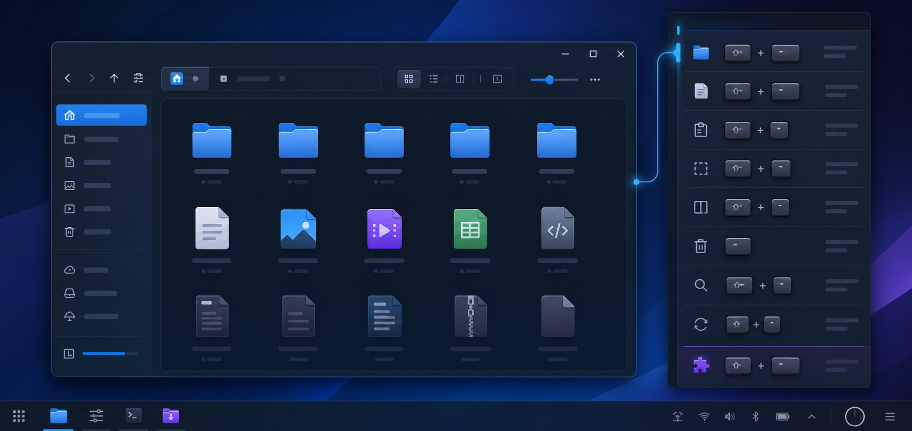
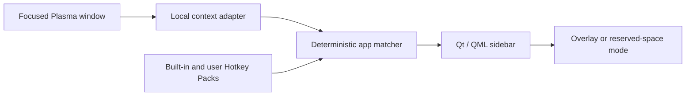

<p align="center">
  
</p>

<h1 align="center">Hotkey Helper</h1>

<p align="center">
  The shortcuts you need, beside the app you are using.
</p>

<p align="center">
  An offline, context-aware keyboard shortcut sidebar for KDE Plasma.
</p>

<p align="center">
  <a href="https://github.com/ObiJuanDeanobi/hotkey-helper/actions/workflows/validate.yml"></a>
  <a href="LICENSE"></a>
  
  
</p>



> [!IMPORTANT]
> Hotkey Helper is in the design and early-prototype stage. The pack format,
> validation tools, Dolphin starter pack, and architecture are in the repo.
> The working Plasma sidebar is the next milestone.

## Why Hotkey Helper?

Linux applications are powerful, but much of that power is hidden behind
keyboard shortcuts that new users are expected to already know. Hotkey Helper
turns that memorization problem into a small, useful companion:

- Focus an application.
- Reveal Hotkey Helper with a global shortcut or tray icon.
- See a concise, categorized cheat sheet for that application.
- Click or scroll the panel without losing the current app's context.

It is designed for people moving to Linux, experienced users learning a new
application, and contributors who want to share useful shortcut references.

## Designed to feel at home on Plasma

| | |
|---|---|
| **Context-aware** | Matches the focused application using stable desktop and window identifiers. |
| **Private by design** | Packs, settings, matching, and normal operation stay completely local. No account, telemetry, or cloud service. |
| **Your choice of placement** | Use a transparent overlay or reserve space along a screen edge. |
| **Simple community packs** | Add support for another application with a data-only JSON file—no C++ or QML required. |
| **Verified references** | Bundled shortcuts include source URLs and a verification date. |
| **Safe to extend** | Hotkey Packs cannot run scripts, commands, or executable code. |

## How it works



When the panel itself receives focus, Hotkey Helper remembers the last real
application. This means you can interact with the sidebar without it forgetting
which shortcuts it should show.

## Hotkey Packs

A Hotkey Pack is a human-readable JSON file that describes one application,
how to recognize it, and which shortcuts to show:

```json
{
  "schemaVersion": 1,
  "id": "org.example.app",
  "name": "Example App",
  "version": "1.0.0",
  "description": "Common shortcuts for Example App.",
  "license": "CC0-1.0",
  "match": {
    "desktopIds": ["org.example.app"],
    "windowClasses": ["example-app"]
  },
  "metadata": {
    "homepage": "https://example.org",
    "sources": [{
      "id": "official-docs",
      "title": "Example App keyboard shortcuts",
      "url": "https://example.org/shortcuts",
      "verifiedAt": "2026-07-23"
    }]
  },
  "shortcuts": [{
    "id": "new-tab",
    "action": "New Tab",
    "keys": ["Ctrl+T"],
    "category": "Tabs",
    "sourceId": "official-docs"
  }]
}
```

See [Creating a Hotkey Pack](docs/creating-hotkey-packs.md) for the full
authoring workflow or browse the
[Dolphin starter pack](packs/org.kde.dolphin.json).

## What is here today?

- [x] Product decisions and acceptance criteria
- [x] Plasma-first architecture
- [x] Versioned JSON Schema
- [x] Dependency-free pack validator
- [x] CachyOS application inventory tool
- [x] Source-verified Dolphin starter pack
- [x] Automated tests and GitHub Actions validation
- [ ] Qt 6 / QML application shell
- [ ] Plasma Wayland focused-window integration
- [ ] Tray icon, global toggle, and persistent settings
- [ ] Overlay and reserved-space presentation
- [ ] CachyOS package and installation guide

The immediate target is one honest end-to-end slice: focus Dolphin on CachyOS
with KDE Plasma 6, toggle the panel, and see the correct shortcuts entirely
offline.

## Explore the current tools

Python 3 is the only requirement for the repository's current validation and
inventory utilities.

Validate every bundled pack:

```bash
python tools/validate_pack.py packs
```

Run the automated tests:

```bash
python -m unittest discover -s tests -v
```

Inventory applications on the target CachyOS machine:

```bash
python tools/inventory_apps.py --include-package-owner
```

The inventory export intentionally excludes host names, user names, and
application command arguments.

## Contributing

The easiest first contribution is a Hotkey Pack for an application you use.
Pack contributions should use authoritative shortcut documentation, include
verification metadata, and pass the local validator.

Read [CONTRIBUTING.md](CONTRIBUTING.md) before opening a pull request. Product
behavior lives in the [product specification](docs/product-spec.md), and
implementation boundaries live in the [architecture](docs/architecture.md).

## Project principles

- Local and offline by default
- No telemetry
- Honest support claims
- Data-only community packs
- Accessible, unobtrusive interface
- Small, reviewable contributions

## License

Hotkey Helper's source code and project documentation are available under the
[GNU General Public License v3.0](LICENSE). Individual Hotkey Packs declare
their own data license; bundled community packs should normally use
[CC0-1.0](https://creativecommons.org/publicdomain/zero/1.0/).

Hotkey Helper is an independent community project and is not affiliated with or
endorsed by KDE or CachyOS.
